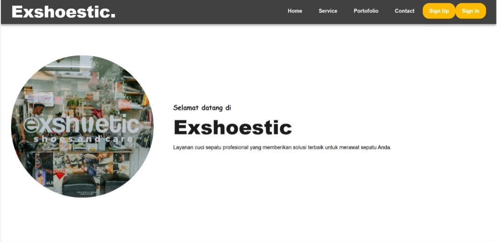

# Exshoestic

**Exshoestic** adalah aplikasi berbasis web untuk layanan cuci sepatu profesional. Proyek ini dirancang untuk membantu pengguna dalam memesan layanan cuci sepatu dengan mudah, mengelola status pesanan, dan memberikan pengalaman pelanggan yang menyenangkan.



## Fitur Utama

- **Registrasi dan Login**: Pengguna dapat membuat akun dan login untuk mengakses layanan.
- **Pemesanan Online**: Memungkinkan pelanggan untuk memesan layanan cuci sepatu secara online.
- **Pelacakan Pesanan**: Pelanggan dapat melacak status pesanan mereka secara real-time.
- **Katalog Layanan**: Informasi tentang berbagai jenis layanan cuci sepatu yang tersedia.
- **Notifikasi**: Memberikan notifikasi kepada pengguna terkait status pesanan.

## Teknologi yang Digunakan

- **Frontend**: HTML, CSS, JavaScript, React.js
- **Backend**: Node.js
- **Database**: Mysql

## Cara Menjalankan Proyek

1. **Clone Repository**

   ```bash
   https://github.com/Isan955/Exshoestic-UAS.git
   cd exshoestic
   ```

2. **Instalasi Dependensi**
   Pastikan Node.js dan npm telah terinstal di sistem Anda, kemudian jalankan:

   ```bash
   npm install
   ```

3. **Konfigurasi Lingkungan**
   Buat file `.env` di root proyek dan tambahkan konfigurasi berikut:

   ```env
   PORT=3306
   ```

   DB_CONNECTION=mysql
   DB_HOST=127.0.0.1
   DB_PORT=3306
   DB_DATABASE=yourdb
   DB_USERNAME=yourusername
   DB_PASSWORD=yourpassword

4. **Menjalankan Aplikasi**
   Untuk menjalankan aplikasi dalam mode pengembangan:

   ```bash
   npm run dev
   ```

   Aplikasi akan berjalan di `http://localhost:3000`.

## Struktur Proyek

```
exshoestic/
|-- project/
|-- dokumen/
|-- README.md
```

Proyek ini dilisensikan di bawah [MIT License](LICENSE).

## Kontak

Jika Anda memiliki pertanyaan atau saran, silakan hubungi kami melalui email di arraypicture@gmail.com.
